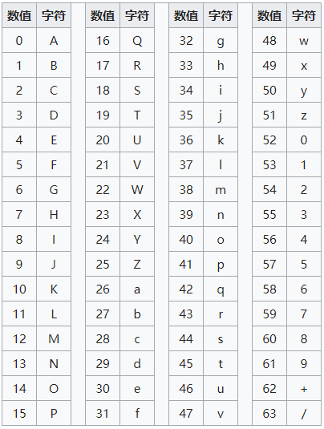
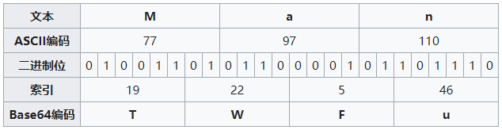
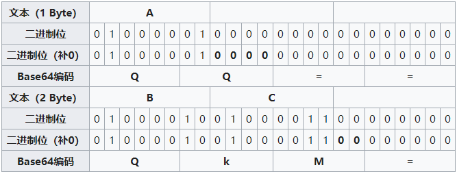

# Base64 的由来

目前 Base64 已经成为网络上常见的传输 8bit 字节代码的编码方式之一。在做支付系统时，系统之间的报文交互都需要使用 Base64 对明文进行转码，然后再进行签名或加密，之后再进行（或再次 Base64）传输。那么，Base64 到底起到什么作用呢？

在参数传输的过程中经常遇到的一种情况：使用全英文的没问题，但一旦涉及到中文就会出现乱码情况。与此类似，网络上传输的字符并不全是可打印的字符，比如二进制文件、图片等。Base64 的出现就是为了解决此问题，它是基于 64 个可打印的字符来表示二进制的数据的一种方法。

电子邮件刚问世的时候，只能传输英文，但后来随着用户的增加，中文、日文等文字的用户也有需求，但这些字符并不能被服务器或网关有效处理，因此 Base64 就登场了。随之，Base64 在 URL、Cookie、网页传输少量二进制文件中也有相应的使用。

# Base64 的编码原理



上面就是 Base64 的索引表，字符选用了 “A-Z、a-z、0-9、+、/” 64 个可打印字符，这是标准的 Base64 协议规定。在日常使用中我们还会看到 “=” 或 “==” 号出现在 Base64 的编码结果中，“=” 在此是作为填充字符出现，后面会讲到。转换步骤如下：
- 将待转换的字符串每三个字节分为一组，每个字节占 8bit，那么共有 24 个二进制位。
- 将上面的 24 个二进制位每 6 个一组，共分为 4 组。
- 在每组前面添加两个 0，每组由 6 个变为 8 个二进制位，总共 32 个二进制位，即四个字节。
- 第四步，根据 Base64 编码对照表获得对应的值。



若要编码的字节数不能被 3 整除，最后会多出 1 个或 2 个字节，那么可以使用下面的方法进行处理：先使用 0 字节值在末尾补足，使其能够被 3 整除，然后再进行 Base64 的编码。在编码后的 Base64 文本后加上一个或两个 = 号，代表补足的字节数。也就是说，当最后剩余两个八位字节（2 个byte）时，最后一个 6 位的 Base64 字节块有四位是 0 值，最后附加上两个等号；如果最后剩余一个八位字节（1 个byte）时，最后一个 6 位的 base 字节块有两位是 0 值，最后附加一个等号。



Base64 字符表中的字符原本用 6 个 bit 就可以表示，现在前面添加 2 个 0，变为 8 个 bit，会造成一定的浪费。因此， Base64 编码之后的文本，要比原文大约三分之一。 

# API

JavaScript 提供两个方法来处理 Base64 编码和解码操作：btoa 方法将字符串或二进制值转化为 Base64 编码，atob 方法将Base64 编码转化为原来的编码。需要说明的是，在进行使用这些方法进行编码和解码的时候需要考虑到非 ASCII 码字符的情况，若是非 ASCII 码字符那么需要插入浏览器转码的操作。

```js
function base64Encode(str) {
    return window.btoa(unescape(encodeURIComponent(str)));
}
 
function base64Decode(str) {
    return decodeURIComponent(escape(window.atob(str)));
}
 
base64Encode('Man');                 
base64Decode('TWFu'); 
```

或者使用[第三方包](https://github.com/dankogai/js-base64)，里面封装了对应编码和解码的方法。

yarn add js-base64

```js
const Base64 = require("js-base64").Base64;
Base64.encode('hello');      // aGVsbG8=
Base64.decode('aGVsbG8=');  // hello
```
